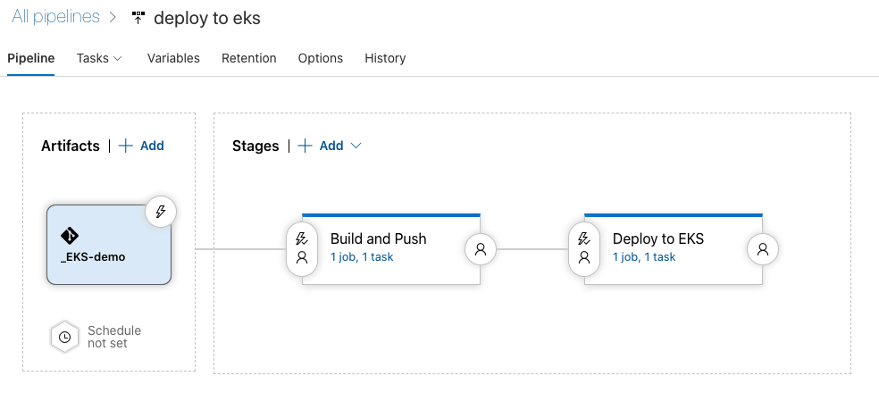

# AWS ECR,EKS를 사용하는 Azure DevOps CI/CD 데모

## 요약
Azure DevOps를 사용해 Docker Image를 빌드하고 ECR에 Push, 이후 EKS에  빌드된 이미지를 배포하는 CI/CD 데모
## 데모 환경
- Application
    - Job Info Scrapping Web Application v2
        - Lang: Python 3.8.6
        - Framework: Flask 1.1.2
        - [Link to Origin Application Project](https://github.com/hyukjuns/flask-webapp-cicd-demo)
- AWS
    - ECR: Base Image 및 Application Image 저장
    - EKS: 배포 환경, 데모에서는 빌드된 Application을 pod로 띄움
        - Service Account: Azure DevOps를 통해 배포시 사용하기위해 사전에 생성 필요, 클러스터에 배포가능한 권한 부여 필요
- Azure DevOps
    - Release Pipeline
    - **Azure DevOps는 CI를 위해 Build Pipeline(Pipelines), CD를 위해 Release Pipeline(Releases)로 나누어 사용하는 것을 권장하지만 이번 데모는 시간상의 이유로 Release 파이프라인만을 사용하여 CI/CD를 구현하였다.**
---
## 데모 시나리오
## CI/CD In Release Pipeline
### Stage 1: Build and Push
1. ECR에서 Base Image Pull
2. Agent에 Docker 설치
3. Base Image의 digest 값 확인
4. Docker 빌드
5. ECR로 빌드된 이미지 Push 
### Stage 2: Deploy to k8s
1. ECR의 빌드된 Application Image를 EKS로 배포

---

## *Service Connection 정보
Service Connection이란 Azure DevOps에서 각 플랫폼에 접근하기 위해 사용하는 Credential이다.
### To AWS
- ECR,EKS를 관리할 수 있는 권한을 가진 AWS IAM 정보 사용
### To k8s(EKS)
- 사전에 k8s에 생성해둔 Service Account 등록
- *EKS 플랫폼 자체를 관리할 수 있는 IAM을 통한 배포가 아닌 k8s Cluster에 등록된 SA를 통해 배포가 이루어 진다.
