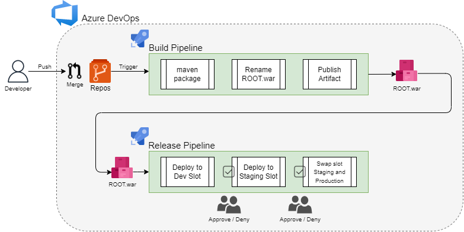
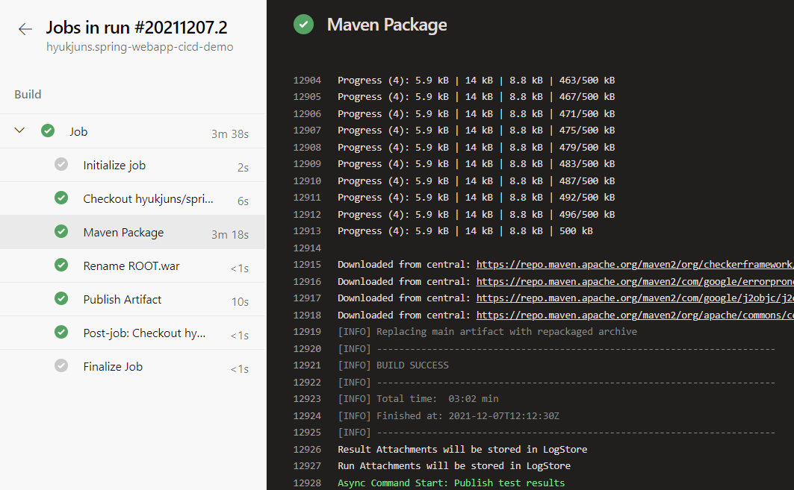
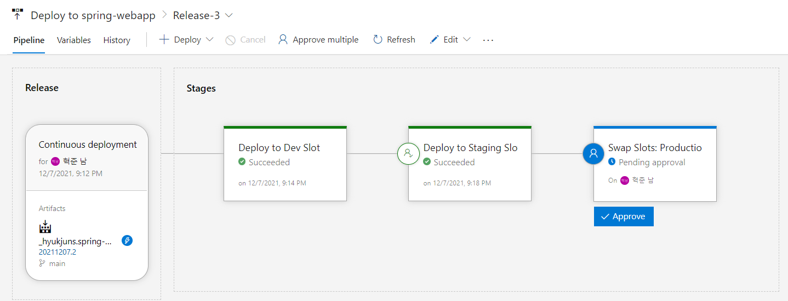
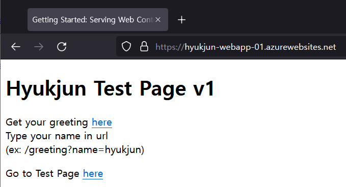

# Spring Web Application CI/CD Demo
[](https://dev.azure.com/hyukjun/spring-demo/_build/latest?definitionId=30&branchName=main)

## 요약
Azure DevOps를 사용해 Spring Framework Web application을 빌드하고, Azure App Service - Webapp에 배포하는 CI/CD 데모
* Source repository는 Azure Repos에 Github repository를 import하여 사용할 수 있습니다.
## 데모 환경
### Spring Framework Project
[spring-boot settings](https://start.spring.io/)

    - Spring Initailizer
        - Maven Project
        - Java Version: 8 (OpenJDK 1.8)
        - Spring Boot: > 2.6.0
        - Packaging: War
        - Dependancies   
            - Spring Web
            - Thymeleaf
            - Spring Boot DevTools
### Azure
    - App Service
        - Webapp for Linux
            - Slot: Production, Dev
            - Runtime stack: Java 1.8, Tomcat 8.5 (TOMCAT|8.5-jre8)
### Azure DevOps (CI/CD Platform)
    - CI: Pipelines
    - CD: Releases
## 데모 시나리오

### CI (Build Pipeline)
- Source Merge -> Maven package -> Rename ROOT.war -> Publish Artifact


### CD (Release Pipeline)
- Deploy to Dev Slot -> Deploy to Staging Slot -> Swap Slot: Staging and Production



### 파이프라인 완료 후 Production Slot



---
## Commands
### Run
#### mvnw
```
mvnw spring-boot:run
```
#### war
```
java -jar <WARFILE>.war
```
### Build
```
mvnw package
```
### Java Command
Compile -> .class
```
javac <JAVAFILE>.java
```
Excuting Class
```
java <ClassName>
```
Excuting JAR or WAR
```
java -jar <FILENAME>.jar or <FILENAME>.war 
```
#### Reference
[Spring GetStarted](https://spring.io/guides/gs/serving-web-content/)
 
