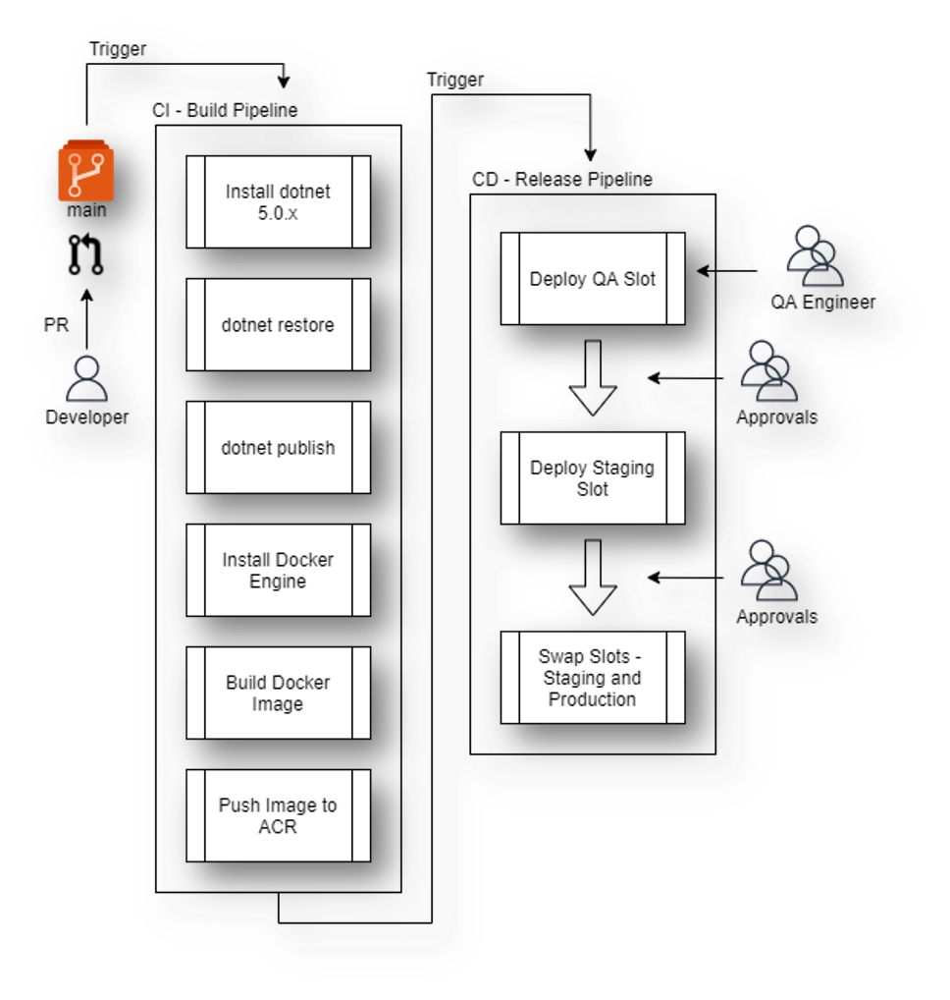
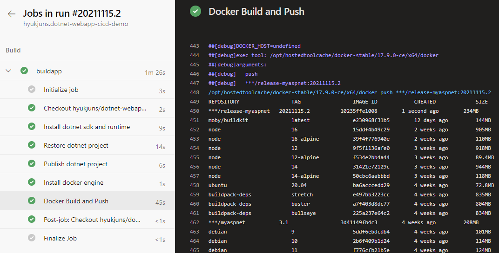
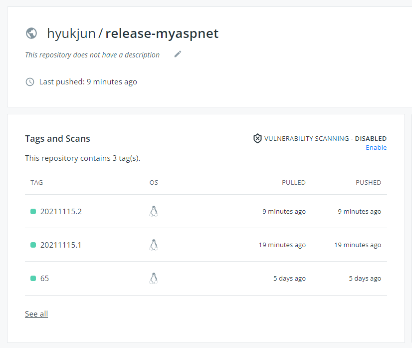
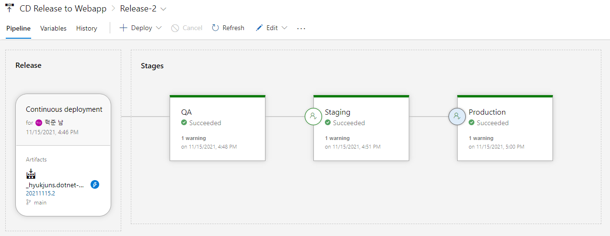
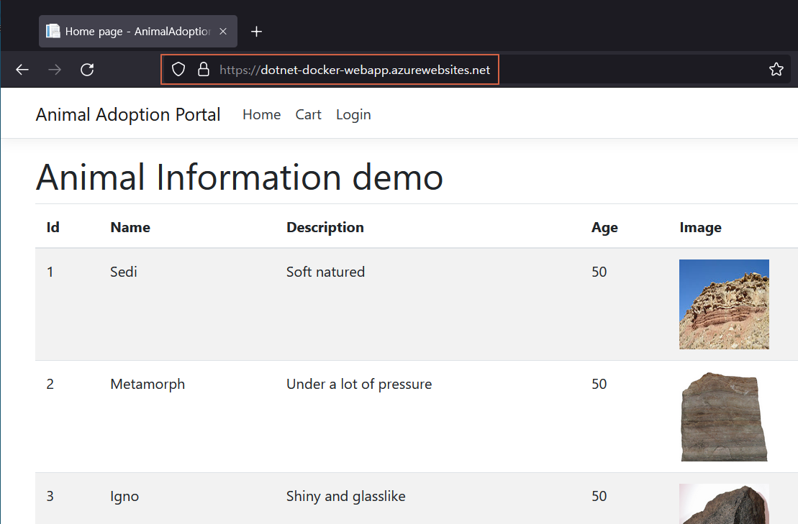

# ASP.NET Web Application CI/CD Demo

## 요약
Azure DevOps를 사용해 ASP.NET Web Application을 Docker Image로 빌드 하고 ACR에 Push(혹은 Dockerhub도 가능합니다), 이후 Azure Webapp for Container(Linux)에 배포하는 CI/CD 데모
(빌드시 Azure Artifact NuGet Feed에 저장된 Nuget Packgage를 사용)
## 데모 환경
- Web Project
    - AnimalAdoption.Web.Portal -> Web Project
    - AnimalAdoption.Common.Logic -> Library Project
- Azure DevOps (CI/CD Platform)
    - CI: Pipelines
    - CD: Releases
- Azure
    - App Service
        - Webapp for Container(Linux)
        - 3 Slot: Production, Staging, QA
    - ACR (Azure Container Registry)
        - Base Image (ASP.NET Core 3.1)
        - Web Application Image
- [option] Dockerhub
    - Base Image (ASP.NET Core 3.1)
    - Web Application Image
## 데모 시나리오
### Diagram

### Build Pipeline (CI)
1. Source code → Repos (main branch)
2. Auto Trigger Build Pipeline
3. Build ASP.NET App and Build Docker Image
4. Push Image to ACR or Dockerhub

### Release Pipeline (CD)
1. Auto Trigger Release Pipeline
2. Deploy QA Slot (ACR to Webapp)
3. Deploy Staging Slot (ACR to Webapp)
4. Swap Staging and Production Slot (Webapp Slot Swap)

