# spring-vmss-cicd-demo
Azure DevOps를 사용한 Spring Application to Azure VMSS CI/CD 데모
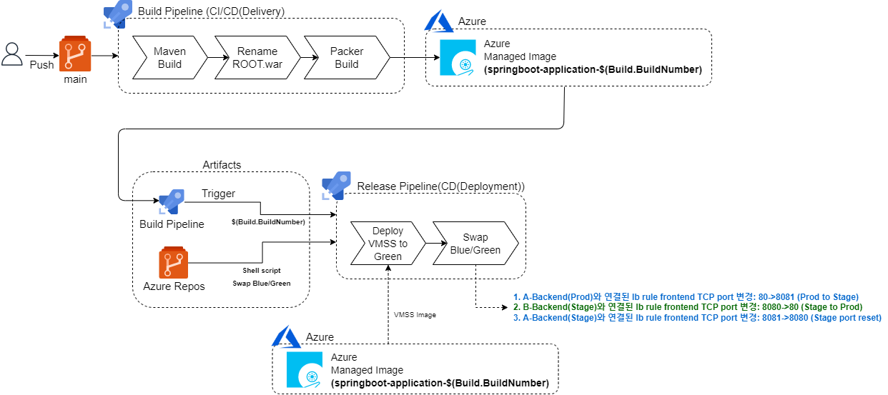

## Sample Spring Project
### Spring Framework
- Spring Initailizer
    - Maven Project
    - Java Version: 8 (OpenJDK 1.8)
    - Spring Boot: > 2.6.0
    - Packaging: War
    - Dependancies   
        - Spring Web
        - Thymeleaf
        - Spring Boot DevTools

## Azure DevOps
- Build Pipeline (CI/CD(Delivery))
    - Maven Build
    - Rename War
    - Packer Build
        - Ubuntu 18.04
        - JDK 1.8
        - Tomcat 8.5
        - Spring Web Application
- Release Pipeline(CD(Deployment))
    - VMSS 배포
    - BLUE/GREEN 스왑

# spring-vmss-cicd-demo
## 시나리오
1. BLUE(Prod, a-backend)에서 v1.0 운영중
    - a-backend -> BLUE(Prod)
    - b-backend -> GREEN(Stage) -> 현재 비어있는 상태
2. 작업자 소스 변경
    - git push to main or 브랜치 전략 사용
3. Auto Trigger -> Build Pipeline
    - 커스텀 이미지 빌드 후 Azure Managed Image로 Delivery
4. Auto Trigger -> Release Pipeline
    1. GREEN(Stage, b-backend)으로 v2.0 배포
        - b-backend -> GREEN(Stage)
    2. 승인/거부
    3. Swap BLUE/GREENLB
        - Load Balancer의 frontend port를 스왑하여 BLUE/GREEN 배포 구현
            - a-backend -> GREEN(Stage)
            - b-backend -> BLUE(Prod)


## 사전 준비된 환경
1. 1개의 로드밸런서에 2개의 백앤드(a, b) 존재
2. a 백앤드에 v1.0 VMSS 운영중인 상태
3. 백앤드 구성
    - a-backend -> BLUE(Prod), 
    - b-backend -> GREEN(Stage)
        - BLUE(Production), GREEN(Stage): 블루는 프로덕션, 그린은 스테이징 환경으로 고정하였습니다.

## Build Pipeline
* 빌드 파이프라인 변수(패커빌드 시 사용)
    - file_path: $(System.DefaultWorkingDirectory)/packer-app-image (패커 빌드 시 사용될 파일들의 위치(tomcat.service, ROOT.war))
    - managed_image_name: 약속된 이미지 이름 전달
    - managed_image_resource_group_name: Azure 상에 존재하는 리소스 그룹 전달(새로운 이미지 생성되는 리소스그룹)
1. Maven Build
2. .war 파일 이름 변경 (-> ROOT.war)
3. Packer Build 
    1. jdk 설치
    2. tomcat 설치
    3. tomcat 서비스등록/서비스시작
    4. tomcat appBase로 ROOT.war 배포
    5. VM Deprovision
-  Artifact: Azure 상에 Managed Image 생성
    - 이미지 이름: <약속된이미지이름-$(Build.BuildNumber)>

## Release Pipeline
### Artifacts
- Build Pipeline
- Azure Repos project

### Release Pipeline
- 릴리스 파이프라인 변수: 
    - BLUE-LB-RULE-NAME: 현재 Production 환경의 백앤드에서 사용중인 Load Balancer Rule 이름
    - GREEN-LB-BACKEND-POOL-NAME: VMSS가 배포될 Stage 환경의 Backend Pool 이름
    - GREEN-LB-RULE-NAME: 현재 Stage 환경의 백앤드에서 사용중인 Load Balancer Rule 이름
    - GREEN-SUBNET-NAME: VMSS가 배포될 Stage 환경의 subnet 이름
- 시스템 변수
    - Release.Artifacts.<ARTIFACT_ALIAS>.BuildNumber
        - Artifacts로 사용된 Build Pipeline의 Build Number를 불러와 VMSS 배포 시 새로 생성된 이미지를 식별하는데 사용
1. GREEN 영역에 VMSS 배포
    - 필요 변수 (-> 매개변수 위치)
        - GREEN-SUBNET-NAME (->$1)
        - Release.Artifacts.<ARTIFACT_ALIAS>.BuildNumber (->$2)
        - GREEN-LB-BACKEND-POOL-NAME (->$3)
    - azcli를 사용한 vmss 배포 (재차 배포시 VMSS 이름 중복 유의)
        ```
        az vmss create \
        -n "b-vmss" \
        -g "rg-packer" \
        --load-balancer "vmss-lb" \
        --vnet-name "vmss-vnet" \
        --subnet $1 \
        --image "springboot-application-$2" \
        --vm-sku "Standard_A2_v2" \
        --admin-username  "<USERNAME>" \
        --admin-password "<PASSWORD>"  \
        --backend-pool-name $3 \
        --upgrade-policy-mode "Automatic" \
        --instance-count 2
        ```

2. BLUE/GREEN 트래픽 변경 (포트 스왑)
    - 필요 변수(-> 매개변수 위치)
        - BLUE-LB-RULE-NAME(-> $1)
        - GREEN-LB-RULE-NAME(-> $2)
    - azcli를 사용한 lb frontend port 변경
        ```
        # BLUE: 80 -> 8081
        az network lb rule update -g "rg-packer" --lb-name "vmss-lb" -n $1 --frontend-port "8081" --protocol "Tcp"

        # GREEN: 8080 -> 80
        az network lb rule update -g "rg-packer" --lb-name "vmss-lb" -n $2 --frontend-port "80" --protocol "Tcp"

        # BLUE: 8081 -> 8080
        az network lb rule update -g "rg-packer" --lb-name "vmss-lb" -n $1 --frontend-port "8080" --protocol "Tcp"
        ```
    - 포트 스왑 절차
        - 프로덕션 lb rule의 frontend port 변경 (90->8081) -> 운영계 다운타임
        - 스테이징 lb-rule의 frontend port 변경 (8080->80) -> 스테이징으로 사용되던 백앤드를 프로덕션 백앤드로 사용
        - 8081로 변경된 frontend port를 8080으로 변경 (8081->8080) -> 추후 다음 버전 배포시 기존 스왑 규칙 사용 위함

## BLUE/GREEN 배포 다이어그램
1. **v1.0 운영**

    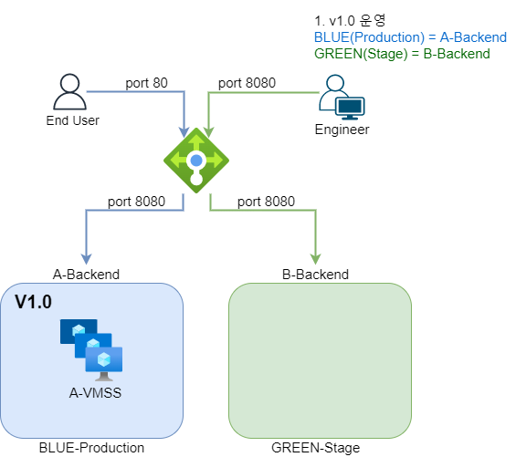

2. **v2.0 배포**

    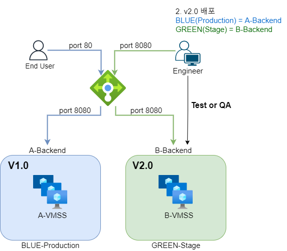

3. **v2.0 운영**

    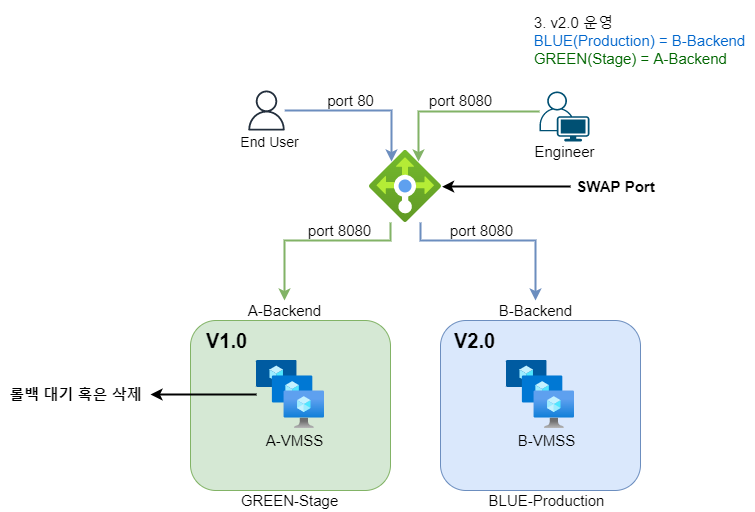
    
## 결과화면
### 배포 전

- v1.0 page (80)

    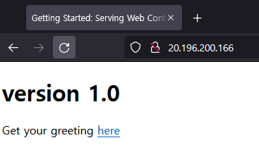

- LB
    - backend

        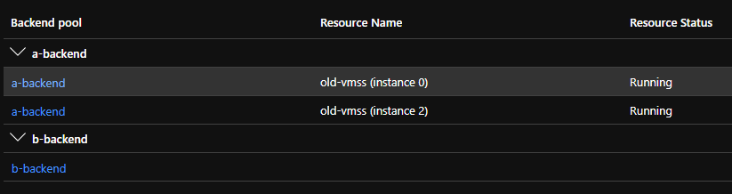

    - lb rule

        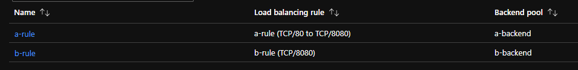


### GREEN 배포 후

- v1.0 page (80)

    

- v2.0 page (8080)

    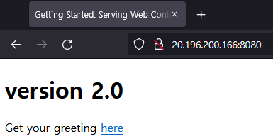

- LB
    - backend

        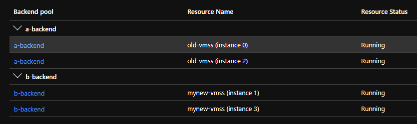

    - lb rule

        


### BLUE/GREEN 스왑 후

- v1.0 page (8080)

    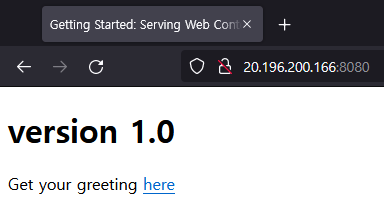

- v2.0 page(80)

    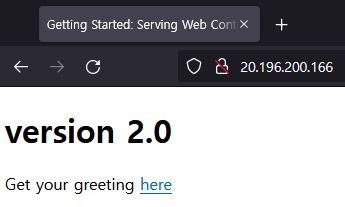

- LB
    - backend

        

    - lb rule

        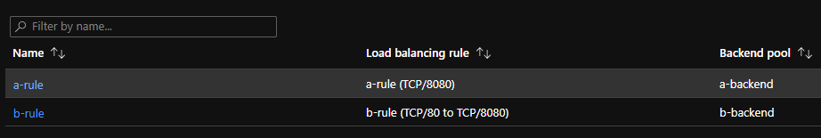