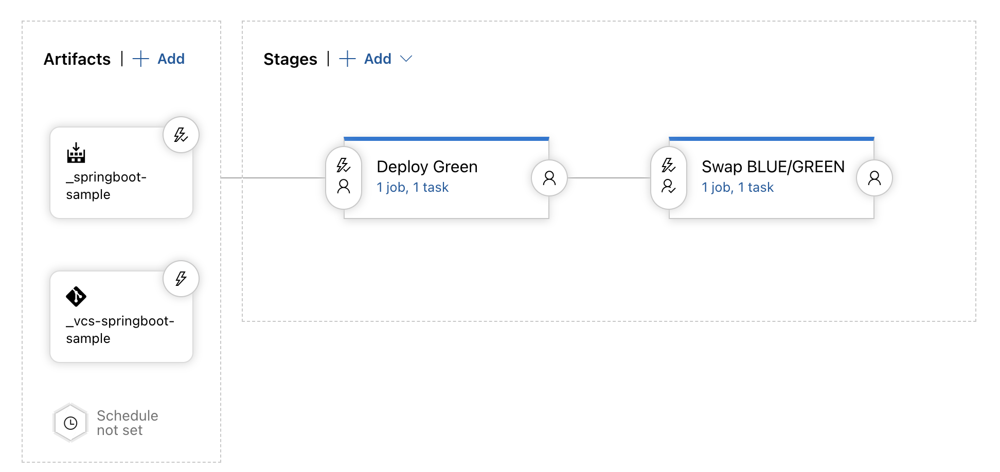
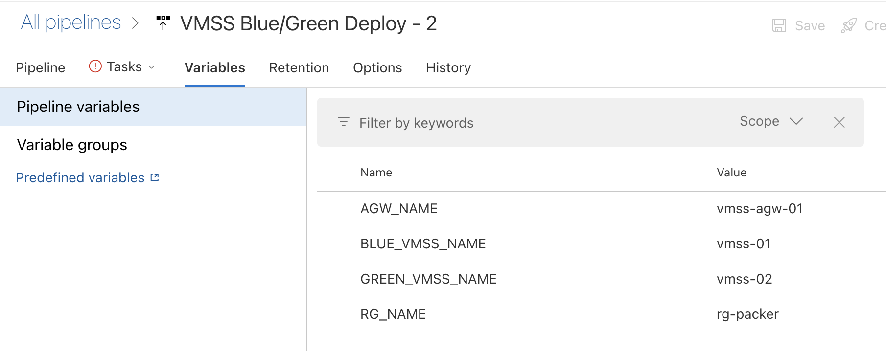

# ado-packer-vmss-spring
Azure DevOps Pipeline을 사용하여 Spring Application을 빌드하고 Azure VM 이미지로 만들어 Azure VMSS에 Blue/Green 전략으로 배포하는 CI/CD 데모


# CI/CD Step
## 1. Sample Spring Application 준비

```markdown
# Spring Boot - Spring Initailizer
    - Maven Project
    - Java Version: 8 (OpenJDK 1.8)
    - Spring Boot: > 2.6.0
    - Packaging: War
    - Dependancies   
        - Spring Web
        - Thymeleaf
        - Spring Boot DevTools
```

## 2. Build Pipeline 구성
### Build Tasks 요약
```markdown
1. Maven Build
2. Rename War Artifact
3. Packer Build
    3.1 Base Image: Ubuntu 18.04
    3.2 Install JDK 1.8
    3.3 Install Tomcat 8.5
    3.4 Enroll Tomcat to Systemd Service and Start & Enable Tomcat
    3.5 Deploy Artifact(Application) to Tomcat AppBase
```
### azure-pipelines.yaml
```yaml
trigger:
  branches:
    include:
      - main
  paths:
    include:
      - src/main/resources/static

stages:
- stage:
  jobs:
    - job:
      pool:
        vmImage: ubuntu-latest
      steps:
      - task: Maven@3
        inputs:
          mavenPomFile: 'pom.xml'
          publishJUnitResults: true
          testResultsFiles: '**/surefire-reports/TEST-*.xml'
          javaHomeOption: 'JDKVersion'
          jdkVersionOption: '1.8'
          mavenVersionOption: 'Default'
          mavenAuthenticateFeed: false
          effectivePomSkip: false
          sonarQubeRunAnalysis: false
      - task: Bash@3
        inputs:
          targetType: 'inline'
          script: |
            pwd
            cp *.war $(System.DefaultWorkingDirectory)/packer-app-image/ROOT.war
            ls -l
            cd  $(System.DefaultWorkingDirectory)/packer-app-image/
            ls -l
          workingDirectory: '$(System.DefaultWorkingDirectory)/target'
      - task: PackerTool@0
        inputs:
          version: '1.7.8'
      - task: Packer@1
        inputs:
          connectedServiceType: 'azure'
          azureSubscription: 'hyukjun-packer'
          templatePath: '$(System.DefaultWorkingDirectory)/packer-app-image'
          command: 'build'
          variables: |
            file_location=$(System.DefaultWorkingDirectory)/packer-app-image
            managed_image_name=springboot-application-$(Build.BuildNumber)
            managed_image_resource_group_name=rg-packer
```
### Packer file
```packer
source "azure-arm" "autogenerated_1" {
  # 앱정보
  client_id                         = "${var.client_id}"
  client_secret                     = "${var.client_secret}"
  subscription_id                   = "${var.subscription_id}"
  tenant_id                         = "${var.tenant_id}"

  # 이미지 만들때 사용될 Base Image
  location                          = "${var.location}"
  image_offer                       = "${var.offer}"
  image_publisher                   = "${var.publisher}"
  image_sku                         = "${var.sku}"
  os_type                           = "${var.os_type}"
  vm_size                           = "${var.size}"
  ssh_username = "azureuser"

  # 앞으로 생성될 정보
  managed_image_name                = "${var.managed_image_name}"
  managed_image_resource_group_name = "${var.managed_image_resource_group_name}"
  
  # 태그
  azure_tags = {
    team = "${var.team}"
    worker = "${var.worker}"
    version = "v2.0"
  }
}

build {
  sources = ["source.azure-arm.autogenerated_1"]

  # JAVA, TOMCAT 설치
  provisioner "shell" {
    execute_command = "chmod +x {{ .Path }}; {{ .Vars }} sudo -E sh '{{ .Path }}'"
    inline_shebang  = "/bin/sh -x"
    inline          = [
        "apt-get install -y wget",
        "mkdir -p /tmp/lib && cd /tmp/lib",
        "cd /tmp/lib",
        "wget https://download.java.net/java/GA/jdk15/779bf45e88a44cbd9ea6621d33e33db1/36/GPL/openjdk-15_linux-x64_bin.tar.gz",
        "tar xfz openjdk-15_linux-x64_bin.tar.gz -C /usr/local",
        "wget http://archive.apache.org/dist/tomcat/tomcat-8/v8.5.59/bin/apache-tomcat-8.5.59.tar.gz",
        "tar xfz apache-tomcat-8.5.59.tar.gz -C /usr/local",
        "cd /usr/local",
        "ln -s apache-tomcat-8.5.59/ tomcat",
        "bash -c 'echo \"JAVA_HOME=/usr/local/jdk-15\" >> /etc/profile'",
        "bash -c 'echo \"JRE_HOME=/usr/local/jdk-15\" >> /etc/profile'",
        "bash -c 'echo \"CATALINA_HOME=/usr/local/tomcat\" >> /etc/profile'",
        "bash -c 'echo \"CLASSPATH=.:$JAVA_HOME/lib/tools.jar:$CATALINA_HOME/lib/jsp-api.jar:$CATALINA_HOME/lib/servlet-api.jar\" >> /etc/profile'",
        "bash -c 'echo \"PATH=$PATH:$JAVA_HOME/bin:$CATALINA_HOME/bin\" >> /etc/profile'",
        "bash -c 'echo \"export JAVA_HOME CLASSPATH PATH CATALINA_HOME JRE_HOME\" >> /etc/profile'",
        "sudo chown -R azureuser:azureuser /usr/local/tomcat/",
        "ls -al /usr/local/tomcat",
        ". /etc/profile",
      ]
  }

  # TOMCAT 서비스 등록
  provisioner "file" {
    source = "${var.file_location}/tomcat.service"
    destination = "~/tomcat.service"
  }

  # TOMCAT 서비스 시작
  provisioner "shell" {
    execute_command = "chmod +x {{ .Path }}; {{ .Vars }} sudo -E sh '{{ .Path }}'"
    inline_shebang  = "/bin/sh -x"
    inline          = [
        "sudo mv /home/azureuser/tomcat.service /etc/systemd/system/",
        "sudo systemctl enable tomcat.service",
        "sudo systemctl start tomcat.service",
      ]
  }

  # TOMCAT appBase에 ROOT.war 배치
  provisioner "file" {
    source = "${var.file_location}/ROOT.war"
    destination = "/usr/local/tomcat/webapps/"
  }

  # 이미지 생성을 위한 Azure VM 에이전트+사용자 삭제
  provisioner "shell" {
    execute_command = "chmod +x {{ .Path }}; {{ .Vars }} sudo -E sh '{{ .Path }}'"
    inline_shebang  = "/bin/sh -x"
    inline          = [
         "/usr/sbin/waagent -force -deprovision+user && export HISTSIZE=0 && sync"
      ]
  }
}

```
## 3. Release Pipeline 구성
### 배포 파이프라인 요약
```markdown
1. New VMSS 배포
2. Load Balancer Port Sawp -> BLUE/GREEN
```

### 스크립트에 사용될 변수 선언
릴리즈 파이프라인 변수로 선언

### deploy-vmss.sh 
VMSS 배포 스크립트
```bash
#!/bin/bash

# $1: GREEN 서브넷
# $2: Build Pipeline의 Build Number, 시스템변수
# $3: GREEN 백앤드풀

# create vmss with new image
az vmss create \
-n "new-vmss" \
-g "rg-packer" \
--load-balancer "vmss-lb" \
--vnet-name "vmss-vnet" \
--subnet $1 \
--image "springboot-application-$2" \
--vm-sku "Standard_A2_v2" \
--admin-username  <USERNAME> \
--admin-password <PASSWORD> \
--backend-pool-name $3 \
--upgrade-policy-mode "Automatic" \
--instance-count 2
```
### lb-traffic-sawp.sh
Load Balancer Port Swap 스크립트
```bash
#!/bin/bash

# BLUE: 80 -> 8081
az network lb rule update -g "rg-packer" --lb-name "vmss-lb" -n $1 --frontend-port "8081" --protocol "Tcp"

# GREEN: 8080 -> 80
az network lb rule update -g "rg-packer" --lb-name "vmss-lb" -n $2 --frontend-port "80" --protocol "Tcp"

# BLUE: 8081 -> 8080
az network lb rule update -g "rg-packer" --lb-name "vmss-lb" -n $1 --frontend-port "8080" --protocol "Tcp"
```